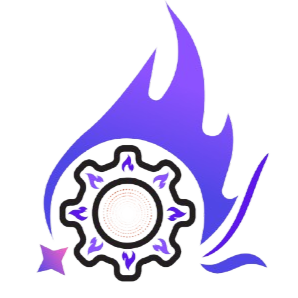

  
  <h1 style="font-family: 'Poppins', sans-serif; font-weight: bold;">Codenovate</h1>

An open hackathon organized by [Recurse](https://www.instagram.com/recurse.official) at Keshav Memorial Institute of Technology (KMIT), where creativity meets technology. 🚀

## About the Event  

**Codenovate** is a platform for students to showcase their technical prowess and creativity by collaborating on innovative projects. Whether you're a beginner or a seasoned programmer, this hackathon is your opportunity to shine, learn, and connect with like-minded individuals.

## Technologies Used  

- **[Next.js](https://nextjs.org/)**: A React framework for building server-side rendered applications.  
- **[TypeScript](https://www.typescriptlang.org/)**: A superset of JavaScript that adds static types for enhanced developer experience.  
- **[Tailwind CSS](https://tailwindcss.com/)**: A utility-first CSS framework for styling responsive and modern designs.  
- **[Framer Motion](https://www.framer.com/motion/)**: A library for smooth and engaging animations in React.  

## Features  

- Collaborative coding and brainstorming sessions  
- Networking opportunities with peers and mentors  
- A stage to present innovative projects and solutions  

## Designed and Developed By  

  
   
  
✨ Animation and design magic by <a href="https://github.com/akuldeepj">Akuldeep Jakkula</a>! ✨

  <h2>🎉 See you at Codenovate! 🎉</h2>

