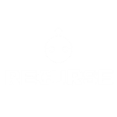

# Codenovate - Recurse Hackathon

 

Codenovate is an open hackathon organized by Recurse at Keshav Memorial Institute of Technology (KMIT). This platform allows students to showcase their skills and collaborate on innovative projects.

## Technologies Used

- **Next.js**: A React framework for building server-side rendered applications.
- **TypeScript**: A superset of JavaScript that adds static types.
- **Tailwind CSS**: A utility-first CSS framework for styling.
- **Framer Motion**: A library for animations in React.

## Get Involved

For more information, visit our [official website](https://www.codenovate.tech).
